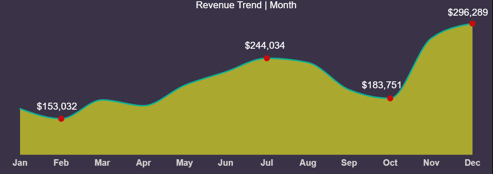
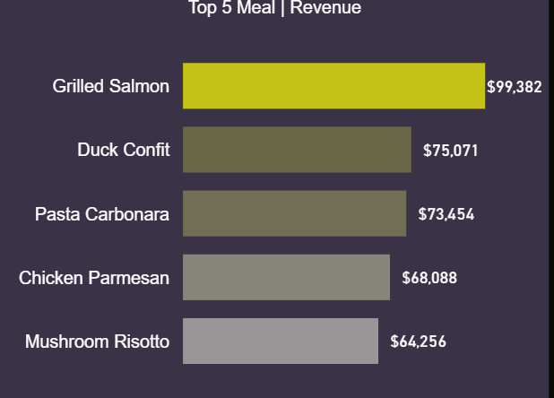
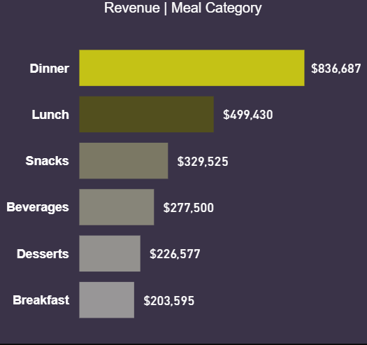
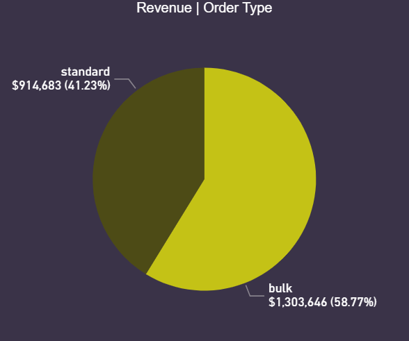
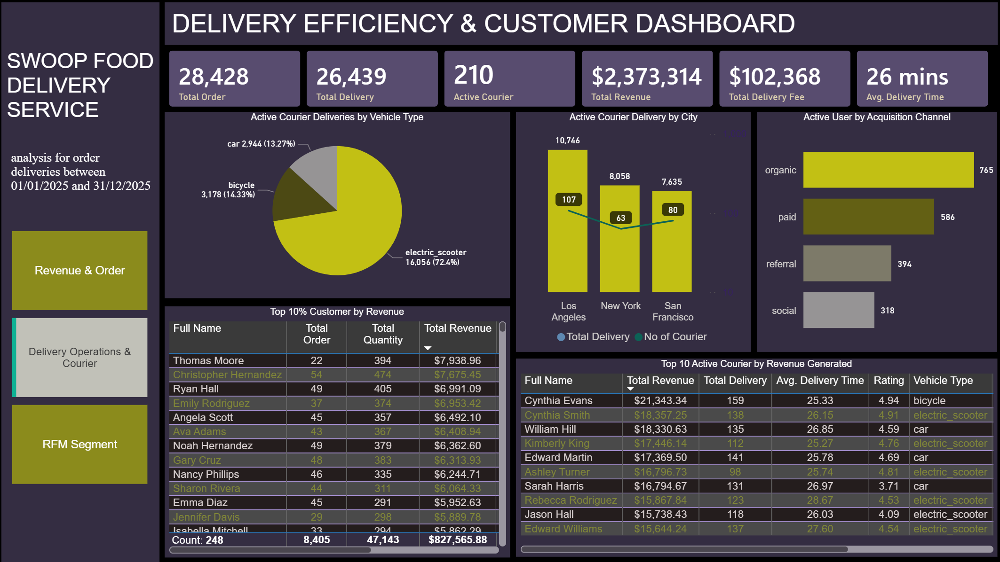
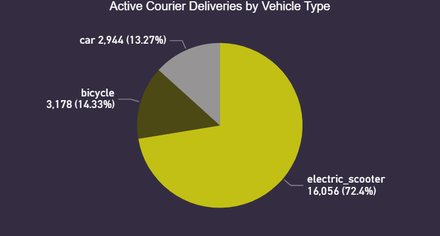
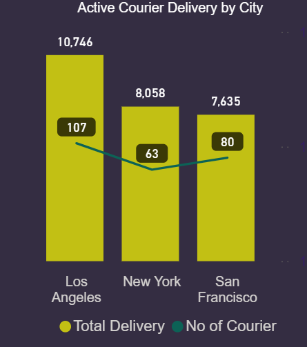
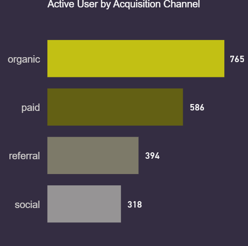
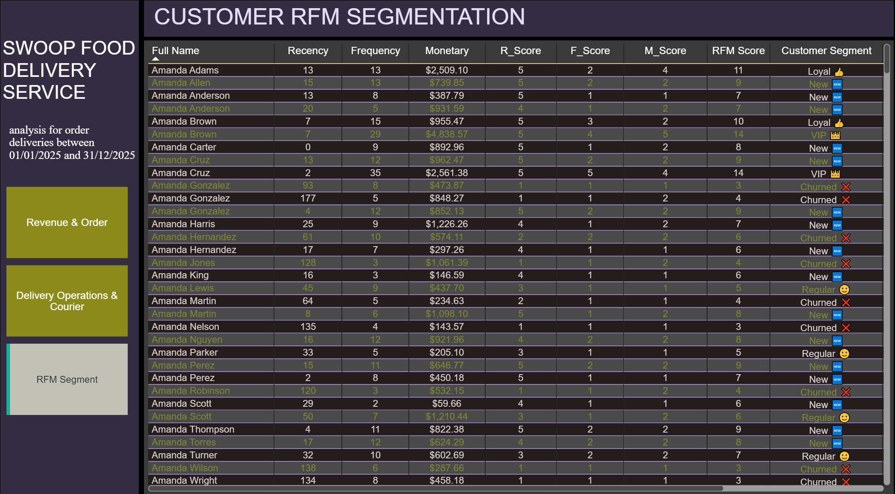

# Swoop Food Delivery Performance Analysis: Revenue, Customer Segmentation & Operational Insights

  

---

## Business Overview
**Swoop** is a fast-growing food delivery platform that enables customers to order from multiple restaurants in a single transaction. Despite strong growth, the company lacked visibility into key business metrics, such as revenue performance, customer retention, delivery efficiency, and profitability.

This project leverages PostgreSQL and Power BI to build an end-to-end analytics solution, transforming operational data into interactive dashboards that support strategic decision-making across revenue, customer behavior, and delivery operations.

---

## Business Problem
Despite rapid growth and a unique multi-restaurant ordering model, **Swoop** lacked the analytical infrastructure needed to support data-driven decision-making. Critical business data was spread across orders, customers, restaurants, and delivery operations, making it difficult to monitor performance and identify growth opportunities.

Key challenges included:

1. **Limited Revenue Visibility:** Difficulty tracking revenue across meal categories, order types, and customer segments, reducing visibility into profitability and growth drivers.
2. **Poor Customer Understanding:** Lack of customer segmentation and monthly analysis limited the ability to identify high-value customers and improve loyalty.
3. **Rising Operational Costs:** Delivery and fulfillment costs were increasing, but there was limited insight into courier performance, delivery efficiency, and per-order economics.
4. **Absence of Centralized Reporting:** Business stakeholders lacked a single source of truth for monitoring KPIs and making timely decisions.

As a result, Swoop faced challenges in **optimizing revenue, improving customer retention, controlling operational costs, and scaling efficiently.**

---

## Project Objectives
This project was designed to transform Swoop's operational data into actionable business insights through **SQL analytics** and **Power BI** reporting. The key objectives were:

1. **Revenue Analytics:** Track revenue by order, customer, and meal category to identify top-performing products, customer spending patterns, and revenue trends.
2. **Customer Analytics:** Identify high-value customers using Top 10% customer analysis, RFM segmentation, and monthly revenue analysis to understand customer behavior and loyalty better.
3. **Operational Analytics:** Evaluate delivery costs, courier performance, vehicle efficiency, and the profitability of different order types to support operational optimization.
4. **Business Intelligence Reporting:** Develop interactive Power BI dashboards that consolidate key KPIs into a single, user-friendly reporting layer for business stakeholders.

---

## Expected Outcome
The analytics solution provides Swoop with:

1. **Revenue Visibility:** Clear insights into revenue drivers, top-performing meal categories, and customer spending trends.
2. **Customer Intelligence:** Improved understanding of customer value, monthly trends, and segmentation for targeted business strategies.
3. **Operational Efficiency:** Better visibility into delivery performance, courier productivity, and delivery cost management.
4. **Faster Decision-Making:** Centralized dashboards that enable stakeholders to monitor business performance and make data-driven decisions in real time.

---

## Data Dictionary and Modelling
1. **Users Table** - Platform user accounts
- user_id
- first_name
- last_name
- email
- phone_number
- city
- signup_date
- acquisition_channel
- device_type
- is_active
2. **restaurants** - Partner restaurant profiles
- restaurant_id
- restaurant_name
- cuisine_type
- city
- region
- address
- avg_prep_time
- commission_rate
- is_active
- joined_date
3. **meals** - Menu items per restaurant
- meal_id
- restaurant_id
- meal_name
- category
- price
- cost_to_make
- is_bulk_eligible
- is_available
4. **orders** - Top-level order transactions
- order_id
- user_id
- promo_id
- order_date
- order_type
- order_status
- payment_methgod
- delivery_fee
- service_fee
- discount_amount
- total_amount
5. **order_items** - Line items within each order
- order_item_id
- order_id
- meal_id
- quantity
- unit_price
- subtotal
6. **deliveries** - Delivery execution per order
- delivery_id
- oder_id
- courier_id
- delivery_status
- pickup_time
- dropoff_time
- delivery_duration
- delivery_address
- city
- region
- delivery_cost
- customer_rating
7. **Couriers**- Delivery fleet members
- courier_id
- first_name
- last_name
- employment_type
- vehicle_type
- rating
- city
- start_date
- is_active
8. **Promotions** - Discount campaigns
- promo_id
- promo_code
- discount_type
- discount_value
- min_order_value
- start_date
- end-date
- is_active
9. **Refunds** - Order refund records
- refund_id
- order_id
- refund_date
- refuind_amount
- refund_reason
- refund_status
10. **Sessions** - User app sessions
- session_id
- user_id
- order_id
- session_start
- session_end
- session_duration
- device_type
- marleting_channel
- led_to_order

  

---

## Approach & Methodology
This project was developed entirely using **PostgreSQL and Microsoft Power BI**, covering the full analytics workflow — from data cleaning and transformation to modeling, analysis, and visualization. The objective was to analyze Swoop’s food delivery performance, focusing on revenue trends, customer segmentation and retention, and operational efficiency.

1️⃣ Data Cleaning & Transformation **(PostgreSQL)**

2️⃣ Used SQL queries to answer business questions and created calculated measures and columns

3️⃣ Interactive Visualization & Dashboard Design **(Power BI)**
- Used card visuals, bar & column charts, pie charts, line graphs, and tables for visualization.

4️⃣ Insights Generation & Business Alignment **(Claude & ChatGPT)**
- Translated findings into actionable business recommendations.

---

🔗 [View the Live Dashboard](https://app.powerbi.com/view?r=eyJrIjoiMDVjMDU4ZWEtNGZhZS00NGFkLWIwZGQtYzk3ODQ3Njk1YzY4IiwidCI6ImZmMGYzZTNhLTNlNTMtNDU0Zi1iMmI1LTZjNjg3NTNiOGVlNCJ9&pageName=f8e5b0818bd549040e45)

---

## 🔢 Revenue & Order Insights Report

  

### 1. 🎯 Top KPIs (Key Performance Indicators)
1. Total Orders: 28,428
2. Total Delivery: 26,439
3. Total Users: 2,500
4. Avg. Spend per User: $100.36
5.  Total Revenue: $2,373,314
6.  Total Delivery Cost: $71,593

**Key Insights**

Delivery costs represent a relatively small portion of total revenue, suggesting:
1. Efficient logistics operations 
2. Good cost management 
3. Healthy operational margins

### 2. 📊 Monthly Revenue Performance
Revenue showed fluctuating but upward growth throughout the year.
- February: Lowest observed point at approximately $153K 
- July: Mid-year peak at $244K 
- October: Revenue dip to $184K 
- December: Highest revenue month at $296K

**Key Insights**

The sharp increase in November–December suggests:
1. Seasonal demand spikes
2. Successful promotional campaigns
3. Increased holiday spending behavior
4. Higher repeat customer activity

**Recommendation**
1. Replicate Q4 marketing strategies earlier in the year
2. Launch seasonal campaigns during slower months (Q1 and Q3)
3. Prepare operational capacity for peak holiday demand 

  

## 3. 🍽️ Top 5 Meals by Revenue

Premium meals dominate revenue generation

Customers are showing a strong preference for:
1. Higher-value menu items
2. Premium dining experiences
3. Protein-based meals

Recommendation
1. Promote top-performing meals in campaigns
2. Introduce premium meal bundles
3. Use Grilled Salmon as a featured marketing product
4. Expand premium menu offerings

  

## 4. 💰 Revenue by Meal Category
Dinner contributes the highest revenue by a large margin. This suggestive:
1. Larger basket sizes during dinner
2. Family/group ordering behavior
3. Peak evening demand

Breakfast generates the lowest revenue, indicating:
1. Untapped market opportunity
2. Lower morning engagement
3. Potential lack of breakfast promotions

Recommendation
1. Increase breakfast-focused campaigns
2. Offer early-morning delivery incentives
3. Introduce combo meal pricing for breakfast and lunch
4. Expand dinner upselling strategies

  

## 5. 💰 Revenue by Order Type
Bulk orders generate nearly 59% of total revenue.

This indicates:
1. Strong corporate/group ordering behavior
2. High-value transactions
3. Efficient revenue concentration

Recommendation
1. Develop dedicated B2B partnerships
2. Create loyalty programs for corporate clients
3. Offer subscription or recurring bulk delivery plans
4. Build specialized enterprise ordering solutions

  

## 6. 📊📱Device Usage Analysis
**Mobile dominates customer engagement** (iOS 44.43% & Android 40.38%)

This may indicate:
- Better app experience and stronger retention on Apple and Android ecosystems.

**Web usage remains low**
Indicating:
- Mobile-first customer preference 
- Limited web platform adoption

**Recommendation**
1. Prioritize mobile app optimization
2. Invest in push notifications and app retention
3. Improve Android-to-iOS conversion gap
4. Enhance web UX for workplace and desktop ordering

  

---

## 🔢 Delivery Efficiency & Customer Insights Report

  

### 1. 🎯 Top KPIs (Key Performance Indicators)
An average delivery time of **26 minutes** positions SWOOP competitively within the food delivery industry, where speed directly impacts:
- Customer satisfaction
- Repeat purchases
- Courier productivity
- Platform ratings

**Recommendation**
1. Maintain delivery times below 30 minutes 
2. Implement predictive dispatching during peak hours 
3. Continue route optimization strategies

### 2. 📊 Courier Delivery Performance by Vehicle Type
**Electric scooters** dominate delivery operations with 72%, suggestive of:
- High urban delivery efficiency 
- Lower fuel and maintenance costs 
- Faster navigation in dense city environments 
- Strong sustainability positioning 

**Cars** contributed the least delivery share, possibly due to:
- Traffic congestion
- Higher operating costs

**Recommendation**
1. Expand electric scooter fleet 
2. Introduce charging partnerships or charging hubs 
3. Optimize bicycle deployment for ultra-short delivery routes 
4. Reserve car deliveries for bulk or long-distance orders 

  

### 3. 📊Delivery Performance by City
**Los Angeles** contributes the highest delivery activity and courier count, indicating:
- Strong market penetration
- Higher customer demand

**New York**, despite having fewer couriers, maintains a strong delivery output.

**San Francisco** demonstrates stable operational distribution between courier capacity and demand.

**Recommendation**

**For Los Angeles**
- Expand courier onboarding
- Introduce zone-based dispatch optimization
- Prepare for scaling during peak demand

**For New York**
- Replicate successful routing strategies in other cities

**For San Francisco**
- Increase customer acquisition efforts
- Improve market penetration campaigns

  

### 4. 📊Customer Acquisition Channel
**Organic traffic** contributes the highest active users, suggesting:
- Strong brand visibility 
- Positive customer experience 
- Effective word-of-mouth exposure 
- Good search and app discoverability 

**Paid acquisition** contributes substantial user activity, showing:
- Marketing campaigns are generating measurable traffic 
- Paid channels are supporting growth and scalability

**Recommendation**
1. Expand referral incentives
2. Invest more in SEO and app-store optimization
3. Improve social engagement campaigns
4. Track customer acquisition cost (CAC) by channel

  

### 5. 📊Top 10% Customers by Revenue
The top 10% of customers (248 customers) generated $827,565.88 in revenue, accounting for 8,405 orders and 47,143 items purchased.

**Recommendation**
1. Retention Strategy

Create:
- VIP loyalty tiers
- Personalized promotions
- Subscription meal plans
- Exclusive premium offers
2. Risk Management
- Avoid overdependence on a small customer segment by:
- Expanding mid-tier customer engagement
- Increasing repeat purchases among average users

  

### 6. Top Active Couriers by Revenue Generated
- Most top-performing couriers use electric scooters, reinforcing operational efficiency advantages
- Some couriers maintain ratings below others despite strong delivery volume, suggesting:
  - Potential customer experience inconsistencies 
  - Workload-related performance fatigue

**Recommendation** 

**1. Courier Performance Optimization**

- Introduce performance-based incentives 
- Reward high customer ratings 
- Provide training for low-rated couriers 

**2. Workforce Planning**

- Use top couriers as operational benchmarks
- Replicate best-performing delivery patterns 

**3. Service Quality Improvement**

Track:
- Delivery delays
- Customer complaints
- Courier idle time
- Rating trends

  

---

## Customer RFM Segmentation Report

**Customers are scored across:**
- R Score
- F Score
- M Score

**Higher scores generally indicate:**
- More active customers
- Higher spending behavior
- Greater loyalty potential

**Scoring System**

i. (r_score + f_score + m_score) >= 13 then 'VIP 👑'

ii. (r_score + f_score + m_score) >= 10 then 'Loyal 👍'

iii. (r_score >= 4 and f_score <= 2 then 'New 🆕'

iv. r_score <= 2 and f_score >= 3 then 'At Risk ⚠️'

v. r_score <= 2 then 'Churned ❌'

vi. others 'Regular 🙂'

**Recommendations for Churn Prevention**

**1. Re-Engagement Campaigns**

Implement:
- “We miss you” promotions 
- Personalized discounts 
- Free delivery offers 
- Retargeting advertisements 

**2. Predictive Retention**

Use RFM scoring proactively to:
- Trigger automated retention campaigns 
- Monitor declining frequency trends

  

---

## 🎯 Strategic Recommendations

**A. Launch a customer retention program for VIP, Loyal, and at-risk customers - highest priority**

i. Create VIP tier rewards (free delivery, exclusive offers, priority support)

ii. Send win-back campaigns to churned users within 14 days

iii. Trigger reactivation discounts for customers inactive beyond 90 days

iv. Build automated personalized offers based on order history

**B. Scale bulk ordering segment**

i. Create dedicated B2B ordering plans

ii. Target offices, institutions, and events

iii. Assign account management for large customers

iv. Offer scheduled recurring meal deliveries

**C. Expand electric scooter operations aggressively**

i. Increase scooter fleet in the highest-performing city 

ii. Recruit scooter-focused couriers 

iii. Introduce charging partnerships 

iv. Prioritize scooters during peak demand routing 

**D. Replicate Q4 growth strategy throughout the year**

i. Analyze what drove the November–December spikes

ii. Repeat campaigns in weaker months (Feb, Sept, Oct)

iii. Build quarterly seasonal promotions

**E. Improve breakfast and underperforming categories**

i. Introduce breakfast bundles

ii. Early delivery discounts

iii. Workplace breakfast promotions

iv. Time-based push notifications

**F. Strengthen referral acquisition immediately**

i. Launch refer-a-friend credits

ii. Incentivize first referral order

iii. Reward repeat referrals

iv. Add referral prompts post-delivery

---

## 90-Day Implementation Plan

**Month 1**
1. Launch VIP retention campaigns
2. Start churn reactivation
3. Analyze top bulk customers
4. Increase scooter courier allocation

**Month 2**
1. Launch B2B bulk sales initiative
2. Introduce referral program
3. Improve breakfast promotions
4. Train low-performing couriers

**Month 3**
1. Automate RFM campaigns
2. Scale seasonal promotions
3. Expand to underperforming cities/channels
4. Track ROI by customer segment

---

## Conclusion

This project analyzed Swoop Food Delivery Service using three key dashboards. Together, these dashboards provide a comprehensive view of **sales performance, operational efficiency**, and **customer behavior** to support strategic decision-making.

- The analysis showed that the business generated strong revenue of approximately **$2.37M** from **over 28,000 orders**, with **bulk orders and dinner sales** contributing the **highest share of revenue.**
- Customer insights revealed that **a small group of high-value customer accounts for a significant portion of sales**, emphasizing the importance of retention and loyalty programs. 
- Operationally, **electric scooters** emerged as the **most efficient delivery method**, supporting faster deliveries and lower costs.
- **Organic acquisition** proved to be the **strongest customer growth channel**.

Overall, the project highlights that Swoop Food Delivery Service has;
- a strong foundation for growth, supported by efficient logistics
- a loyal customer base
- clear market demand. 

The findings suggest that **immediate focus on customer retention, bulk order expansion, and operational optimization** will help **improve profitability and long-term scalability**.

This project demonstrates how data analytics can transform business data into actionable insights, helping stakeholders identify opportunities, address risks, and make informed decisions to drive business growth.

---

## Disclaimer
This project is for portfolio and educational display only.

---

## Connect With Me
- 💼 **LinkedIn:** (https://www.linkedin.com/in/david-okeleye001/)
- 📧 **Email:** okeleyedavid2021@gmail.com
- 🌐 **Portfolio:** https://bit.ly/3N5c1p7
- 🐙 **GitHub:** https://github.com/olavidz01-dev
